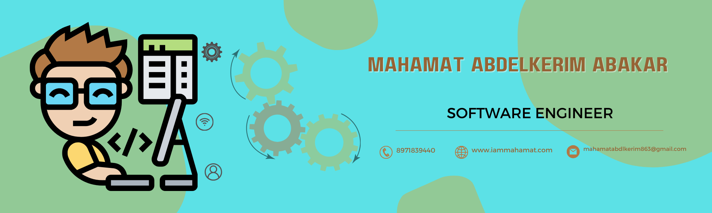

### Hi there,👋

 
  

 

<h3> 👨 Mahamat | 💻 Software Engineer | 🛸 Ndjamena, Chad </h3>

 

 

  

  

<h3 align="left">Talking about Personal Stuff:</h3>

- 🌱 I’m currently developing **Systems** in  Java

- 💬 Ask me about anything tech related, I am happy to help;
- 💻 I love writing code and learn anythings about it

- 📫 How to reach me **mahamatabdelkerim863@gmail.com**

 

<h3 align="left">Connect with me:</h3>

<h3 align="left">Languages and Tools:</h3>

                      

 
<h2 align="center">📊 Github Stats </h2>

 
<h2 align="center">🤝 Support</h2>

🎀 Contributions (<a href="https://guides.github.com/introduction/flow" title="GitHub flow">GitHub Flow</a>), 🔥 issues, and 🥮 feature requests are most welcome!

💙 If you like my projects, Give them ⭐

Let's ❤️ Code 

  

 
<h1 align='center'>⚡️<i>Stay awesome!</i>⚡️</h1>

        

